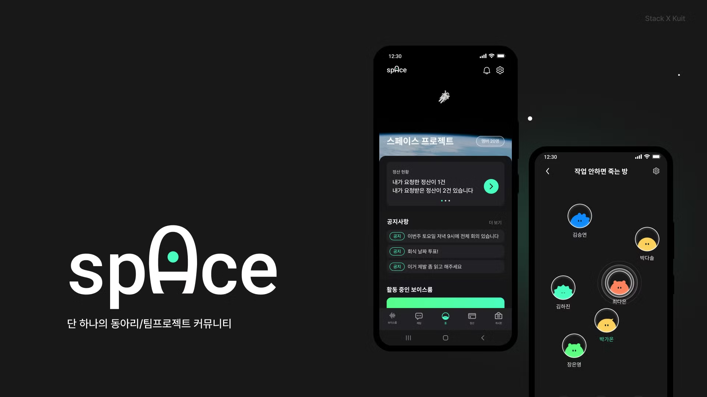

# Konkuk University Developer Community "KUIT" 3rd project :: Space

## 🏆 KUIT 3기 데모데이 최우수상 🏆 [Space :: 단 하나의 동아리/팀프로젝트 커뮤니티](https://kuit-space.github.io/KUIT-Space-front/)

## 개발 스택 및 환경 구성

### Frontend

- React + Typescript + Vite

### Backend

- Java + Spring

## Team Members

### PM

|                                 양석준                                 |
| :--------------------------------------------------------------------: |
|                                                                        |
| [ YangJJune](https://github.com/YangJJune) |

### Frontend

|                                김성유                                |                                   김지환                                   |                                 양석준                                 |                               정연우                                |                                정서현                                |
| :------------------------------------------------------------------: | :------------------------------------------------------------------------: | :--------------------------------------------------------------------: | :-----------------------------------------------------------------: | :------------------------------------------------------------------: |
|                                                                      |          |                                                                        |  |    |
| [ brian770](https://github.com/brian770) | [ Turtle-Hwan](https://github.com/Turtle-Hwan) | [ YangJJune](https://github.com/YangJJune) |  [ woo319](https://github.com/woo319)   | [ hyunn522](https://github.com/hyunn522) |

### Backend

|                                김경민                                |                                 김상준                                 |                                   노성준                                   |                                정서현                                |
| :------------------------------------------------------------------: | :--------------------------------------------------------------------: | :------------------------------------------------------------------------: | :------------------------------------------------------------------: |
|   |      |                                                                            |    |
| [ arkchive](https://github.com/arkchive) | [ drbug2000](https://github.com/drbug2000) | [ seongjunnoh](https://github.com/seongjunnoh) | [ hyunn522](https://github.com/hyunn522) |

### Design

| 김하진 | 박가온 |
| :----: | :----: |
|        |        |
|        |        |
